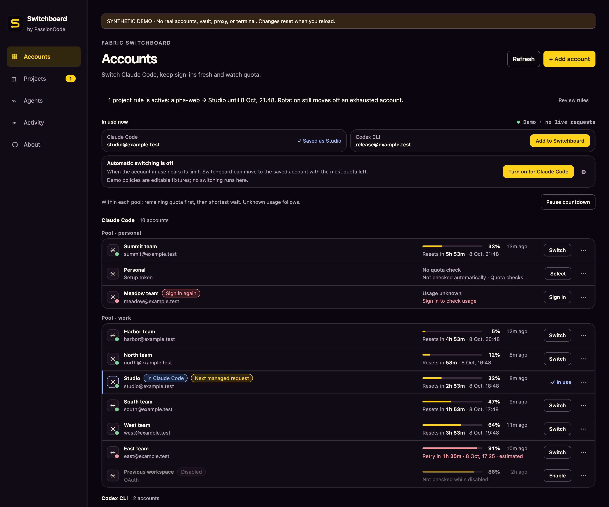

# Fabric Switchboard

**English** · [Русский](README.ru.md)

Local accounts and quota management for **Claude Code, Codex CLI and Kimi Code**.
See which account is in use, check its remaining quota and open a session for your project.
A desktop app, CLI and MCP server for macOS and Windows, built by
[PassionCode.ai](https://passioncode.ai/).

**[Download for macOS](https://passioncode.ai/switchboard/download/macos)** ·
**[Download for Windows](https://passioncode.ai/switchboard/download/windows)** ·
[Installation](docs/INSTALL.md) · [Release notes](CHANGELOG.md) ·
[Product page](https://passioncode.ai/switchboard/)



*Current interface, shown with synthetic demo accounts. [Screenshot provenance](docs/runs/2026-10-08-release-0612/README.md#screenshots).*

## What you can do

| Task | In Switchboard |
|---|---|
| Keep work and personal accounts separate | Account pools, project rules and isolated session homes |
| See when another account is needed | Reported usage, reset countdowns and explicit unknown or expired states |
| Choose the next account | Native Claude switching or managed request routing; a response in progress keeps its identity |
| Use Kimi Code subscriptions | Official sign-in, membership and usage, then launch the chosen account in a project |
| Configure other coding agents | Hermes model/provider settings and OpenRouter launch for supported agents |
| Work from your terminal or agent | `switchboard` CLI, MCP tools and `launch --in-place` |

Saved secrets use macOS Keychain or Windows DPAPI. Automatic switching is opt-in.
Kimi accounts stay in their own sign-in folders; Switchboard does not copy or renew them.
See [account behavior](docs/ACCOUNTS-AND-ROTATION.md) and
[agent support](docs/AGENT-SUPPORT.md) for the boundaries of each mode.

## Release status

**Latest published: [v0.6.14](https://github.com/passioncode-ai/fabric-switchboard/releases/tag/v0.6.14)** · October 8, 2026.
Includes Kimi Code accounts, Hermes model/provider settings, OpenRouter launches and
the Claude sign-in and update-version fixes. [Download verification](docs/runs/2026-10-08-release-0612/README.md#published-release).
Versions 0.6.11–0.6.13 were superseded before publication.

macOS releases are universal, Developer ID signed and notarized by Apple. Windows x64
releases are built natively and are not yet Authenticode-signed. Installed copies from
0.6.1 update automatically. Builds and signatures come from the protected
[release workflow](docs/DISTRIBUTION.md#how-a-release-happens).
Live-provider acceptance is tracked separately on the [board](docs/evidence/backlog.md)
(SB-01, SB-02, SB-15).

Open source under the **GNU AGPL-3.0**, with a commercial license available.
[License details](#license).

## Quick start for a new teammate

1. **Install** the published build: [macOS ZIP](https://passioncode.ai/switchboard/download/macos)
   (redirects to the [latest release](https://github.com/passioncode-ai/fabric-switchboard/releases/latest)),
   check it against `SHA256SUMS` from the release
   (`shasum -a 256 -c SHA256SUMS --ignore-missing` → `OK`), then follow
   [docs/INSTALL.md](docs/INSTALL.md). The app is Developer ID signed, notarized and stapled
   (`spctl -a -vv "Fabric Switchboard.app"` → `accepted, source=Notarized Developer ID`); the
   CLI beside it runs (`./switchboard --version`). Open the app once after installing: it moves
   accounts saved by earlier versions, opens at login from then on, and shows a five-step tour.
2. **Configure:** nothing to set before first run. Accounts are added in the app or with
   `switchboard accounts add … --secret-stdin`; secrets come from your own Claude or Codex
   sign-in and go to the OS vault, never into an environment variable or an argument.
   `--data-dir <absolute dir>` points the CLI at a separate, disposable app-data directory.
3. **MCP:** put the `switchboard` CLI on `PATH` by linking the one inside the app, so it updates
   with the app: `ln -sf "/Applications/Fabric Switchboard.app/Contents/MacOS/switchboard"
   ~/.local/bin/switchboard` (or Agents → *Link switchboard into ~/.local/bin*;
   [INSTALL.md](docs/INSTALL.md)), then either `claude plugin marketplace add passioncode-ai/fabric-switchboard`
   and `claude plugin install switchboard@switchboard` (server plus the `switching-accounts`
   skill), or `claude mcp add --scope user switchboard -- switchboard mcp`. `claude mcp list`
   then shows `switchboard … ✔ Connected`; a first call is the read-only
   `switchboard_accounts` tool (an empty vault answers `{"accounts":[]}`). To prove it with a
   real client without changing your agent config or saved accounts, write a temporary
   `mcp.json` with `{"mcpServers":{"switchboard":{"command":"switchboard","args":["--data-dir","<absolute empty dir>","mcp","--read-only"]}}}`
   and run `claude -p "Call the switchboard_accounts tool once and reply with exactly its JSON result." --strict-mcp-config --mcp-config mcp.json --allowedTools mcp__switchboard__switchboard_accounts --max-turns 3`
   → `{"accounts":[]}` (run 2026-09-30 with the published 0.4.0 CLI:
   [handoff](docs/handoffs/2026-09-30-agpl-standard.md#mcp-proof)). Even with `--read-only` and
   an empty data dir, `switchboard_accounts` reads the current Claude Code and Codex sign-in
   (on macOS the Claude Code Keychain item, through `security find-generic-password`) to report
   which saved account is signed in; it writes, switches and prints nothing from it. 0.4.1
   does not change this read: its Keychain change covers Switchboard's own items. All agents and
   tools: [docs/CLI.md](docs/CLI.md). Measured from the published archive:
   [0.4.0 release record](docs/evidence/release-0.4.md#newcomer-path-from-the-published-release);
   0.4.1 from the published archive: [0.4.1 release record](docs/evidence/release-0.4.1.md#from-the-published-release).
4. **Develop:** `npm ci`, then `./scripts/check.sh` (the gate) and `npm run app:dev`; the CLI is
   `cargo build --release --locked -p switchboard-cli` → `target/release/switchboard`. Start at
   [docs/HANDOFF.md](docs/HANDOFF.md), [AGENTS.md](AGENTS.md) and the layout table in
   [Checks and layout](#checks-and-layout); tests use synthetic fixtures only.

## Documentation

- [Research on four existing tools](docs/research/README.md): sources, architecture,
  storage and switching mechanics; 69 links to fixed commits.
- [Specification](docs/SPEC.md): features, compatibility axes, states, security,
  protocols, Windows and acceptance criteria.
- [Product map (Russian)](docs/PRODUCT.ru.md): what was built, which ideas were borrowed,
  limits and the order of further work.
- [Entry point for the next contributor or agent](docs/HANDOFF.md): checks, decisions and
  the exact next task.
- [CLI](docs/CLI.md): commands, JSON, stdin and the shared session owner.
- [Distribution](docs/DISTRIBUTION.md): macOS universal app/CLI, signing, Windows
  installer/CLI.
- [Agents Switchboard works with](docs/AGENT-SUPPORT.md): the 30 popular coding agents
  (Hermes, Kilo Code, Cline, Goose, OpenCode, …) — tools, proxy and launch, with sources.
- [Usage analytics](docs/ANALYTICS.md): what release builds send (counts and kinds, never
  account names, e-mail addresses or sign-ins), the installation id PassionCode.ai tools share, and
  the switch that turns it off for all of them.

## Running from source

macOS needs macOS 14+, Xcode Command Line Tools, Rust and Node.js. Windows needs Rust
(MSVC), Visual Studio C++ Build Tools, Node.js and WebView2. The official `claude` or
`codex` CLI is needed only to sign in or launch a session, not to run the manager. The
verification status of each platform is in the current build report.

```sh
npm ci
npm run app:dev
```

Build a local app:

```sh
npm run app:build
open 'target/release/bundle/macos/Fabric Switchboard.app'
```

That command alone does not establish Developer ID signing or notarization, and a build
signed on a laptop is a debug build. Releases are built, signed and notarized only by the
[release workflow](docs/DISTRIBUTION.md) in GitHub Actions.
Binaries are not stored in Git. Dependencies are pinned by `Cargo.lock` and
`package-lock.json`; byte-for-byte reproducibility is not claimed.

CLI from source:

```sh
cargo build --release --locked -p switchboard-cli
./target/release/switchboard --help
./target/release/switchboard accounts list
./target/release/switchboard serve
```

`serve`, or an open desktop app, owns the proxy and the sessions. Other CLI commands talk
to that owner automatically. Without an owner, metadata operations run under an exclusive
lock; login and launch need a running runtime.

To look at the interface with synthetic data: `npm run dev`, then
`http://127.0.0.1:1420/?demo=1`. A plain web page does not connect to the vault. The browser
demo has no real accounts, no CLI launch and no network calls to providers.

## Using it

1. **Add account** — official sign-in in a separate profile, an API key, a Claude setup
   token, or explicitly imported OAuth JSON. Switchboard reads the current Claude Code and Codex
   sign-in to show which saved account is in use, but never saves or switches it without you.
2. Set a label and a pool, for example `work` or `personal`. The pool is the routing
   boundary; accounts of different providers are not interchangeable.
3. **Select** — choose the account for the next managed requests.
4. **Launch managed** — pick a project folder and open the CLI through the local proxy.
   The app or `switchboard serve` must stay open. One managed home may run per
   provider/pool.
5. **Launch isolated** — a separate home for the selected account and a direct CLI
   connection to the provider. Later **Select** actions do not affect it.
6. **Check usage** — quota is checked in the background (every 3 minutes for accounts in use or
   in a rotation pool, every 10 minutes otherwise); **Check usage** asks at once. An API key does
   not report a reliable subscription quota; an unknown quota is never shown as zero.
7. **Language** — the window speaks English or Russian, following the operating system;
   About → *Language* overrides it ([SCN-041](docs/ux/scenarios.md#scn-041--use-switchboard-in-russian)).

Use Switchboard in line with the terms of Anthropic and OpenAI. Breaking a provider's terms can
get your account blocked. You are responsible for how you use your accounts.

The persistent credential stays in the OS vault, but isolated mode writes the working copy
of the access token that the official CLI needs into a private file (0600 on macOS, a
user-only DACL on Windows). The refresh token is not written there; when the token
expires, sign in again. Details, recovery after a failure and removal:
[operations guide](docs/OPERATIONS.md).

## Checks and layout

```sh
./scripts/check.sh
# The explicitly requested test creates and deletes only a random synthetic Keychain item:
cargo test -p switchboard-core native_vault_roundtrip_uses_only_random_app_owned_item -- --ignored --exact
```

| Path | Responsibility |
|---|---|
| `crates/switchboard-core` | accounts, Keychain/DPAPI, atomic metadata, route snapshot |
| `crates/switchboard-proxy` | loopback authentication, requests, streams, usage |
| `crates/switchboard-runtime` | shared owner, control API, official login and CLI launch |
| `crates/switchboard-cli` | the `switchboard` command, stdin and JSON |
| `src-tauri` | native window and IPC to the shared runtime |
| `src` | TypeScript interface and the clearly labelled demo |
| `docs` | research, specification, scenarios, contracts and evidence |

Full hosted CI runs nightly — the macOS gate and build, and the native Windows fixtures —
and push and pull requests do not run the full suite. A workflow existing does not mean it
passed.

## Releases

A release is a `vX.Y.Z` tag on the merged release commit. The tag starts
[`release.yml`](.github/workflows/release.yml) in the protected `release` environment: a member
of `release-approvers` approves (whoever pushed the tag may; an agent only on the operator's explicit instruction, which the release record names); the macOS app and CLI are signed
with the organization's CI Developer ID and notarized (the app stapled); Windows is built
natively (Authenticode signing through Azure Artifact Signing is ready but switched off until
the account exists, and the receipt says `windows_authenticode: NOT_SIGNED`); then every file
is attested (Sigstore), summed in `SHA256SUMS`, GPG-signed and published with the notes from
[CHANGELOG.md](CHANGELOG.md). A rehearsal runs the same path on a `vX.Y.Z-rc.N` tag with
`gh workflow run release.yml --ref vX.Y.Z-rc.N -f publish=false` and creates no release.
Details, receipts and the Azure setup: [DISTRIBUTION.md](docs/DISTRIBUTION.md). Other projects' sources were studied but are not included as
dependencies.

## License

Open source under the [GNU AGPL-3.0](LICENSE). A [commercial license](COMMERCIAL-LICENSE.md) is
available for use that does not meet the AGPL's terms — [passioncode.ai/business](https://passioncode.ai/business/).
v0.4.1-beta.1 is the first release under the AGPL. Versions up to and including v0.4.0-beta.1 were released under PolyForm Noncommercial or Internal Use (v0.4.0-beta.1) and the MIT License (v0.3.1-beta.1 and earlier, commits up to and including `7c36f4a`); those releases keep their licence.

The built app and CLI include third-party components under their own licenses; see
[THIRD_PARTY_NOTICES.md](THIRD_PARTY_NOTICES.md). Contributions are accepted under the
[CLA](CLA.md), which allows this dual licence; see [CONTRIBUTING.md](CONTRIBUTING.md).
