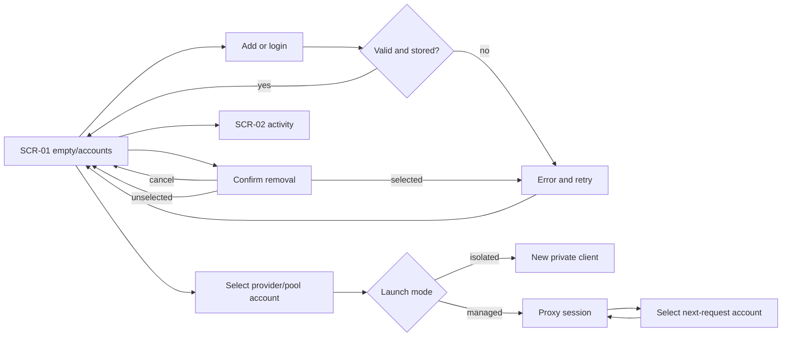

Contract: ux-contract v4
# Flows
## FLW-01 — Account workbench
Traces: ST-001, JTBD-01

```mermaid
flowchart LR
 A[SCR-01 empty/accounts] --> B[Add or login]
 B --> C{Valid and stored?}
 C -->|yes| A
 C -->|no| E[Error and retry]
 A --> D[Select provider/pool account]
 D --> F{Launch mode}
 F -->|isolated| G[New private client]
 F -->|managed| H[Proxy session]
 H --> I[Select next-request account]
 I --> H
 A --> J[SCR-02 activity]
 A --> K[Confirm removal]
 K -->|cancel| A
 K -->|unselected| A
 K -->|selected| E
 E --> A
```
