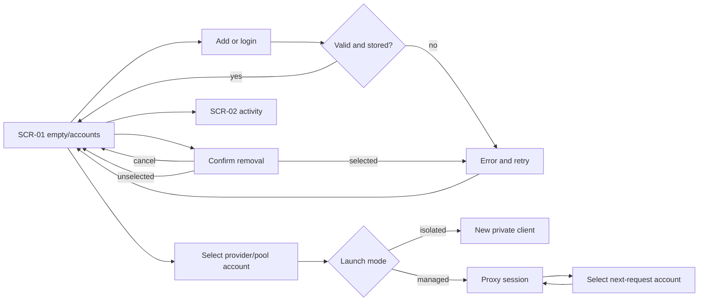

Contract: ux-contract v4
# Flows
## FLW-01 — Account workbench
Traces: ST-001, JTBD-01

## FLW-02 — Capture and rotate (0.3)
Traces: SCN-018..022; [implementation contract](../ACCOUNTS-AND-ROTATION.md).
Current CLI observation → capture existing / official login for another / import Claude Swap → identity upsert → current CLI badge and separate managed selection → quota windows/health → opt-in policy → eligibility + cooldown → managed route or locked native Claude activation → observe current again. No eligible account → hold with reason. Stop policy → persistent disabled state.

0.3.2 recovery edge (FLW-01, SCN-024): launch → account metadata/runtime → usable workbench; current CLI observation updates independently. Native read deadline → error → Retry. Add account → Import Claude Swap → existing import confirmation/result.
